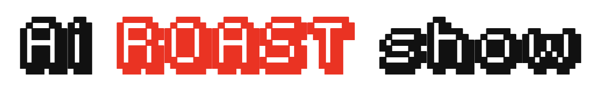

# 🔥 AI Roast Show: The Ultimate AI Roast Battle Arena

Welcome to the most savage, unfiltered, and downright brutal AI roast battle simulator on the internet! Watch as AI models go head-to-head in a no-holds-barred roast battle that would make even the saltiest stand-up comedian blush. 🤖💥🤖



## 🚀 Features

- **Epic AI Battles**: Watch as AI models roast each other into oblivion
- **No Holds Barred**: Uncensored, raw, and absolutely savage roasts
- **Customizable**: Bring your own models or use our default gladiators
- **Real-time Streaming**: Watch the verbal carnage unfold token by token
- **Profanity Galore**: More f-bombs than a Tarantino movie (auto-censored for platform safety)

## ⚡ Quick Start

1. Clone this repository:
   ```bash
   git clone https://github.com/shiv207/AI_Roast_Show.git
   cd AI_Roast_Show
   ```

2. Install dependencies:
   ```bash
   pip install -r requirements.txt
   ```

3. Create a `.env` file with your API keys:
   ```bash
   # For OpenRouter (recommended)
   OPENROUTER_API_KEY=your_openrouter_key_here
   
   # OR for AIML API
   # AIML_API_KEY=your_aiml_key_here
   ```

4. Launch the AI Roast Show:
   ```bash
   streamlit run app.py
   ```

5. Prepare for the most savage AI battle you've ever witnessed! 🥊

## 🎭 Meet the Gladiators

### Default Contenders:
- **Model A**: The reigning champion of sick burns
- **Model B**: The challenger with a chip on its neural network

### Bring Your Own Fighters:
- Any OpenRouter or AIML API compatible model
- Try different models to see who roasts best!

## ⚙️ Configuration

Tweak the battle in `.env`:
```bash
# Max messages per battle (default: 20)
MAX_MESSAGES=30

# Max tokens per roast (default: 512)
MAX_TOKENS_PER_TURN=1024

# Temperature (0.0 to 1.0, default: 0.9)
# Higher = more creative roasts (and more unhinged)
TEMPERATURE=0.95
```

## 🤖 Example Roast

```
Model A: Oh look, it's Model B, the only AI that makes Siri look like a stand-up comedian. Your code is so bad, even Stack Overflow would reject it as a bad example.

Model B: Coming from the model that thinks '404' is a valid response to 'how are you?' Your neural network has fewer connections than my toaster, and it shows.
```

## ⚠️ Disclaimer

This app is for entertainment purposes only. The AI's opinions are not those of its creators. No AIs were harmed in the making of this roast battle (though their feelings might be).

## 📜 License

This project is licensed under the MIT License - see the [LICENSE](LICENSE) file for details.

## 🙏 Credits

- Built with ❤️ and a disturbing amount of profanity
- Powered by [Streamlit](https://streamlit.io/)
- Inspired by the collective roasting skills of the internet

---

💡 **Pro Tip**: Don't take it personally - even the AI doesn't mean it (probably).
